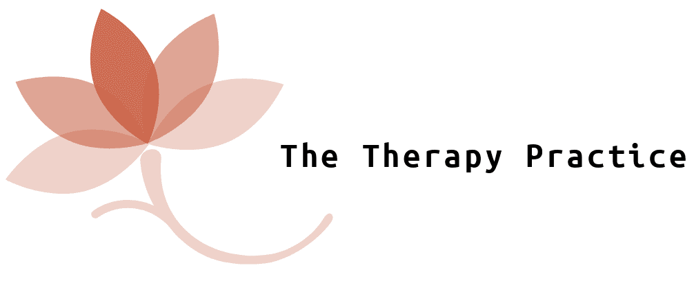
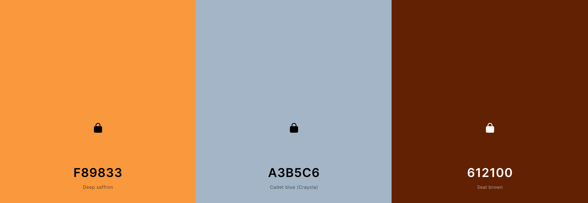

# The Therapy Practice



Thank you for visiting my project, please feel free to read through the Read-me and browse my project, *if you have any questions or suggestions head to my Github contact details.* 

Happy Coding!

## Contents

* UX :computer:

    * Project Goals
    * Target Audience Goals
    * Site Owner Goals
    * User Requirements and Expectations
    * Design Choices 🎨
        * Fonts
        * Icons
        * Colours
        * Styling
        * Images
        * Backgrounds

* Wireframes 🔧
* Features 🎡
    * Features that have been developed
    *  Features that will be implemented in the future

* Technologies Used 👨‍💻
* Testing 🔌
* Bugs 🐞
* Deployment 🚀
* Credits 💳


## UX (User Experience) :control_knobs:

### Project Goals
The goal of this project is to create an __online extension of the work of Charanjit Dosanjh__; _Psychotherapist_, _Occupational Therapist_, _Hypnotherapist_ and inevitably generate leads for her client base. The website is aimed toward anyone seeking guidance with their emotional difficulties. The website will be __promoting a very personal service (Psychotherapy)__ and aims to be inclusive to people of all ages backgrounds and genders. Due to the nature of the service, a whole range of people are likely to be interested and click on the site, therefore the website needs to be __particulary accessible for people at all stages of technological understanding.__ The website must be aesthetically pleasing, informative, sincere and easy to navigate. 

#### User Stories:
* As a user, I expect to find information about a therapists credibility when I visit their site. 
* As a user, if I am browsing potential therapists, I want to know their rates and locality to me.
* As a user I would like to have minimal clicks when trying to find the relevant information. 
* As a user, I want to know what experience the Therapist has, I want to know I am in good hands.
* As a user I want to be able to book a session quickly and easily. 

#### User Stories (in detail)::open_book:

#### Annie Lovett (43/ female):

> I am not the best at technology at all! I do like it when the services I am interested in has a website because then I can find the contact details and email straight away, whilst I'm on the go! When looking for a Therapist the most important thing to me is, that the rates are listed clearly and the contact information, alike. I already know that I want a therapist, it comes down to the person, the money and how to get in contact for me!

#### Mabel Stone (20/ female):

> I started suffering with my mental health whilst at uni and my guidance counsellor suggested I find an experienced Psychotherapist. After having a look, there were nearly none! All the therapists I came across were on other websites and they merely had a brief listing up. I would be grateful to find a working website for a freelance psychotherapist, who goes into detail about what she knows and how she knows it!! Also, I access most websites on my phone, so I would appreciate it if it was a website that was easy to browse on my phone, maybe more scrolling than clicking? 

#### Saroop Singh (36/ female):
> When it comes to therapy I am sceptical. Speaking to a stranger about my problems will not be easy for me, I would need to be reassured with information. I don't want to be overwhelmed by words, but I expect to see clear and concise evidence of the therapist academic and professional history. 


#### Site Owner Goals:
* Promote themselves as a virtual psychotherapist. 
* Generate a stream of new clients. 
* Provide enough information on the site to entice the types of clients with whom her expertise are best suited. 
* Display their credentials in a clear and concise format. We live in an age where many people are claiming to be therapists/ advisors, however, few have the professional experience or indeed education to justify these claims. 
* Assist people to improve their mental health, irrespective of where they live in the world. 
* Educate a person with information that only a qualified professional could share, so that at the very least, Charanjit may gain a recommendation.


## User Requirements and Expectations:
##### Requirements:
* Use the navbar to find the relevant information. 
* Be provided with information on mental health. 
* If the user decides to proceed to book a consultation, they must agree to terms and conditions first. 
* Interact with the consultation booking form. 


##### Expectations:
* Information on Charanjit Dosanjh as a professional.
* responsive site.
* all links open onto a blank new web page, so that they do not lose their point on the site.
* Content is aesthetically pleasing. 
* Navigation takes the user to specific parts of the website.
* Form Validation works correctly.

## Design Choices: 🎨

This entire project has been based on the wishes of Charanjit Dosanjh, she wanted a very active role in the design aspect of the project as she felt that it was an extension of her personality and therefore needs to come through in the site.
She wanted to have a 'warming' colour theme and suggested the colour orange. After looking at some resources such as <a href='https://www.templatemonster.com/blog/warm-cool-color-psychology-web-design/'>this</a> blog post, her suggestion was indeed confirmed as a 'warming' colour! We decided to go with that.

##### Fonts: 
I chose to use the font <a href="https://fonts.googleapis.com/css?family=Roboto&display=swap">ROBERTO</a> as it is very easy to read. Due to the nature of this website, it would have a lot of text and I was eager to ensure it was as palatable as possible. As aforementioned, the focus of the content is to provide an informative yet not overwhelming experience for the potential client, which heavily influenced my decision to choose a font that isn't too ambiguous.


##### Colours:
Using learned knowledge from prior research, Orange is both bright and warm, bright colours increase the memorability of a site and ultimately drives lead generation and for a site promoting such a personal service, the warmth was a key factor Charanjit was keen to employ. I used the colour picker from Dev tools to help me get as close as I good to the deep orange colour within the logo. 

* Navbar and Footer Colour: #F7B32B <strong>Chinese Yellow</strong> It was a bold move to go with a yellow for the navbar and footer, however, I think it works very well and provides the warmth and emotive expression a site like this intends to draw out from the viewer. 

* Primary: #F89833 <strong> Deep Saffron </strong> This is the colour of the about, approach and rates page. I wanted this to be the primary colour because it is bright, warm and soothing. It is also the background colour for the __introduction to Charanjit__, I wanted the prospective client to associate all of the aforementioned colour attributes with __Chaaranjit__. Additionally, it provides a beautiful gradient from the slightly lighter, Chinese yellow which is the colour of the navbar and footer. Instantly the prospective client is feeling, intrigued, excited and happy. 

* Secondary: #A3B5C6 <strong>Cadet Blue (Crayola) </strong> This is the colour of the help, working together and contact page. I wanted a slightly more serious and focused colour to make it easier for the prospective client to absorb the information. 

* Tertiary: #612100 <strong>Bakers Chocolate </strong> This is the colour for the headings and hovers throughout the page the colour provides calmness, depth and focus. 

* Default text colour: #fafafa <strong>Off-white</strong> I felt this colour sat beautifully on the default background colour, making everything very visible and easy to read. 



## Wireframes: 🔧
I built the wireframes for this project using <a href="https://balsamiq.com/">Balsamiq mockups</a>. Initially, I wrote out, each section of the project/ website and what would be on the page. However, it was tough for me to visualise the slightly different sizing of everything as it moved from the desktop through to mobile and that's where Balsamiq wireframes, became very useful.
View my wireframes <a href="https://github.com/mayasaffron/thetherapypractice/tree/master/assets/wireframes">here.</a>

## Features: 🎡

* Background video (#home)
* Background video (#working-together)
* Easy Navigation Colours 
* Contact Form (#contact)


## Technologies Used: 👨‍💻

### Languages:

* <a href="https://developer.mozilla.org/en-US/docs/Web/HTML">HTML</a>
* <a href="https://developer.mozilla.org/en-US/docs/Web/CSS">CSS</a>
* <a href="https://www.w3schools.com/js/">JavaScript</a>

### Tools & Libraries:

* <a href="https://jquery.com/">jQuery</a>
* <a href="https://popper.js.org/">Popper js</a>
* <a href="https://git-scm.com/">Git</a>
* <a href="https://getbootstrap.com/">Bootstrap</a>
* <a href="https://fontawesome.com/icons?d=gallery">Font-Awesome</a>
* <a href="https://validator.w3.org/">W3C Validation service was used to check HTML. </a>
* <a href="https://jigsaw.w3.org/css-validator/">W3C Markup validation services used to check CSS.</a>


## Testing: 🔌
The basis of Psychotherapy can be very daunting. Therefore, a website promoting the services of a Psychotherapist can also be fairly intimidating to the prospective client, depending on where they are in their journey. It was very important to me that nothing on the site would distract a person, seeking help, from getting the help they desired. I tested the site every step of the way. 

Test Planning:
As I was so anxious to see how everything looked and worked as soon as I built it, I was very hasty with my tests and it became very time-consuming. My plan was literally: Build something --> Test it. In future projects, I hope to have more of a concrete testing approach to my work, so that I save time. 

Testing Stories:
I was informed that the colours I had initially chose clashed too much in terms of contrast, I then used coolors.co to select a new colour scheme and implemented the new colours.

I struggled a lot with layout, with the nature of the site being very wordy, I was more concerned with putting out the most informed and accurate content and neglected the layout. Eventually, I had to rethink my entire site layout and even changed from a multiple page site to a scrolling site. I also started to use "Cards" From Bootstrap, whenever I was using text and an image on a page. 

During a mentor session, I was informed that the background video on the home page was causing the entire site to flicker when scrolling, I then placed a div, only visible on mobile around the homepage and placed a still image inside and this considerably helped. 

Overall:
Responsiveness -

Plan 📝: I knew that this project needed to be FULLY responsive and mobile-friendly, therefore, the obvious option to use Bootstrap as this HTML Framework I'm most comfortable using. To test, I used dev-tools throughout my project.  

Implementation 🏭: Throughout writing my HTML code making sure to use appropriate bootstrap class modifiers to provide correct breakpoints for the content and the applying the advice from my mentor to "add-in mobile visible specific divs where necessary". Testing breakpoints was relatively simple thanks to the easy to use Bootstrap.
Result 🏆: The Responsiveness of the site works as expected, no elements or content escape their boundaries or are hard to see on any device.
Verdict ✅: This test has passed and therefore the site is responsive.
Design -

Plan 📝: The overall design of the site had to reflect the service being offered, calmness and curiosity needed to be conveyed through the colours and imagery. Using the colour scheme I chose not only provides great contrast but worked well for provoking emotional responses. 
Implementation 🏭: Adding these colours and varying their shades based on feedback, regarding the emotional response triggered, the readability and the visual satisfaction, gathered from a wide range of people, proved to be the most effective way to test this. 
Result 🏆: The colours were chosen in the end work well for the theme of the site. When readability was compromised, sufficient backgrounds were added, so that the text 'pops'. 
Verdict ✅: This test has passed and the overall colour scheme is complementary to the site goals.

Features:
Background video (#home) -

Plan 📝: I was over halfway through my project when I decided to add a background video to my landing page. I could not find another alternative, which would emotionally regulate prospective clients in the same way. 
Implementation 🏭: Using HTML tags I added the relevant video HTML and paid close attention to the styling of both the video and the video -content. I played with the z-index property in CSS and also had to find an alternative to the video, which was as aesthetically pleasing, for when the site is accessed via mobile. During the testing process, I would struggle with white space that I would see on the site when it was at Tablet size, to solve this I had to move the video element tags around until the white space was not there. 
Result 🏆: The video looks beautiful on a large screen and at the mobile size it becomes an equally as beautiful picture. 
Verdict ✅: This test passed.


Bugs: 🐞
Bugs During Development:
During the development process for this project, I was fortunate to not have to battle with many annoying bugs. Listed below are a few issues that I faced and overcame during the project.

Radio Button Error:

Bug 🕷: I wanted to use as many elements as possible in my form because I had gotten carried away with the variety on offer and temporarily lost sight of the importance of easy-user experience. The radio checkbox in the form would check both boxes, despite the question requiring the response of just one box.

Fix 🔧: I reworded the form and found that the question was now obsolete! I got rid of the code and simplified the form. 
Verdict ✅: This bug was squashed thanks to my mentors helpful __Keep It Simple Stupid__ mantra!

Bug 🕷: A few elements were escaping the boundaries of the website and were causing an unwanted horizontal scroll.
Fix 🔧: Using Unicorn Revealer (See credits for link) I was easily able to find the offending element and fix accordingly.
Verdict ✅: This bug was squashed easily and meant I could continue to progress.
Known Bugs:
Here is a list of known bugs that exist on the site: ❌

A bug exists on the landing page video when it is viewed at 4K 2560px, in future I will solve the issue by using dev tools to re-size the relevant wrappers and containers of the video.


## Deployment: 🚀
The Therapy Practice was developed on GitPod, using git and GitHub to host the repository.

When deploying The Therapy Practice using GitHub Pages the following steps were made:

* Opened up <strong>GitHub</strong> in the browser.
* Signed in using username and password.
* Selected my <strong>repositories</strong>.
* Navigated to <strong>'/mayasaffron/thetherapypractice'</strong>.
* In the top navigation clicked <strong>'settings'</strong>.
* Scrolled down to the <strong>GitHub Pages</strong> area. 
* Selected <strong>'Master Branch'</strong> from the <strong>'Source'</strong> dropdown menu.
* Clicked to confirm my selection.
* The Therapy Practice is now live on GitHub Pages.


#### Running The Therapy Practice Locally
Cloning The Therapy Practice from GitHub:

* Navigate to <strong>'/mayasaffron/thetherapypractice'</strong>.
* Click the green <strong>'Clone or Download'</strong> button.
* Copy the <strong>url</strong> in the dropdown box.
* Using your favourite <strong>IDE</strong> open up your preferred <strong>terminal</strong>.
* Navigate to your desired file location. 
* Copy the following <strong>code</strong> and input it into your terminal to clone Holiday Destinations.
 ```git
  git clone https://github.com/mayasaffron/thetherapypractice.git
   ```


## Closing Notes:
Developing this project has taught me not just about coding, but methodical thinking in general. I feel that HTML and CSS are the second nature now! I have learnt the usefulness of Bootstrap and the importance of not over complicating the code.  In the future, I would like to implement other features like a live chat feature and add payment and social media links to the footer. Said online payment and social media accounts do not currently exist, but will in the future!
## Credits: 💳

#### Project Structure
* Used George Pyott's Read me as a template for read me as it was excellent. <a href="https://github.com/Geomint/holiday-destinations"> Link Here</a> 
* Used<a href="https://chrome.google.com/webstore/detail/unicorn-revealer/lmlkphhdlngaicolpmaakfmhplagoaln/related?hl=en-GB"> Unicorn Revealer </a>To help with the white space caused by stray elements. 

#### Design 
* Used <a href="https://hatchful.shopify.com/your-logos"></a> To design my logo.
* Used<a href="https://coolors.co/78e8b2-ff8552-dbd56e-f7b32b-f67e7d"></a> To source my colour scheme.
#### Images from Issues page 
* Photo by Valentin Antonucci on Unsplash <a href="https://images.unsplash.com/photo-1535578195295-f2329b3cdb8d?ixlib=rb-1.2.1&ixid=eyJhcHBfaWQiOjEyMDd9&auto=format&fit=crop&w=934&q=80">Relationship Breakdown</a>
* Photo by Ethan Kent on Unsplash <a href="https://images.unsplash.com/photo-1536611517872-e0d5493e2164?ixlib=rb-1.2.1&ixid=eyJhcHBfaWQiOjEyMDd9&auto=format&fit=crop&w=1650&q=80">Greif and loss</a> 
* Photo by Tobias Stonjeck on Unsplash <a href="https://images.unsplash.com/photo-1532178910-7815d6919875?ixlib=rb-1.2.1&ixid=eyJhcHBfaWQiOjEyMDd9&auto=format&fit=crop&w=750&q=80">Depression</a>
* Photo by Zan on Unsplash  <a href="https://images.unsplash.com/photo-1570710020202-37829801d105?ixlib=rb-1.2.1&ixid=eyJhcHBfaWQiOjEyMDd9&auto=format&fit=crop&w=2850&q=80">Child and Parent</a>
* Photo by Gabriele Diwald on Unsplash <a href="https://images.unsplash.com/photo-1519165678289-8dec49bc74f0?ixlib=rb-1.2.1&ixid=eyJhcHBfaWQiOjEyMDd9&auto=format&fit=crop&w=800&q=60">Anxiety</a>
* Photo by Maria Hochgesang on Unsplash <a href="https://images.unsplash.com/photo-1558023131-908cab000962?ixlib=rb-1.2.1&ixid=eyJhcHBfaWQiOjEyMDd9&auto=format&fit=crop&w=800&q=60">Identity</a>

#### Videos used throughout the site
* __#home__:<a href="https://www.pexels.com/video/beautiful-butterfly-on-a-flower-1433307/">Video by Rahul Sharma from Pexels
* __#working-together__:<a href="https://www.pexels.com/video/digital-projection-of-the-earth-mass-in-blue-lights-3129957/">Video by Pressmaster from Pexels