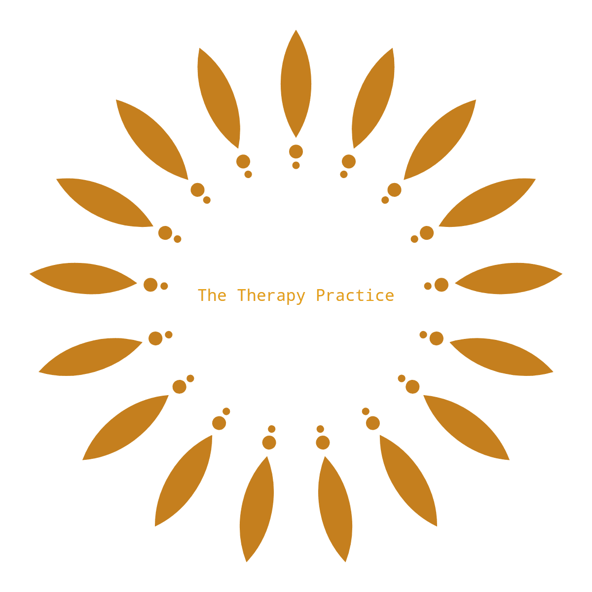

# The Therapy Practice

Thankyou for visiting my project, please feel free to read through the Read-me and browse my project, *if you have any questions or suggestions head to my Github contact details.* 

Happy Coding!

## Contents

* UX :computer:

    * Project Goals
    * Target Audience Goals
    * Site Owner Goals
    * User Requirements and Expectations
    * Design Choices 🎨
        * Fonts
        * Icons
        * Colours
        * Styling
        * Images
        * Backgrounds

* Wireframes 🔧
* Features 🎡
    * Features that have been developed
    *  Features that will be implemented in the future

* Technologies Used 👨‍💻
* Testing 🔌
* Bugs 🐞
* Deployment 🚀
* Credits 💳

## UX (User Experience) :control_knobs:

### Project Goals
The goal of this project is to create an __online extension of the work of Charanjit Dosanjh__; _Psychotherapist_, _Occupational Therapist_, _Hypnotherapist_ and inevitably result in an increase of clients for her to help. The website is aimed toward anyone seeking guidance with their emotional difficulties. The website will be __promoting a very personal service (Psychotherapy)__ and aims to be inclusive to people of all ages backgrounds and genders. Due to the nature of the service, a whole range of people are likely to be interested and click on the site, therefore the website needs to be __particulary accesible for people at all stages of technicalogical understanding.__ The website must be aesthetically pleasing, informative, sincere and easy to navigate. 

#### User Stories:
* As a user I expect to find information about a therapists credibility when I visit their site. 
* As a user, if I am browsing potential therapists, I want to know their rates and locality to me.
* As a user I would like to have minimal clicks, when trying to find the relevant information. 
* As a user, I want to know what experience the Therapist has, I want to know I am in good hands.
* As a user I want to be able to book a sessions quickly and easily. 

#### User Stories (in detail)::open_book:

#### Annie Lovett (43/ female):

> I am not the best at technology at all! I do like it when the services I am interested in has a website because then I can find the contact details and email straight away, whilst I'm on the go! When looking for a Therapist the most important thing to me is, that the rates are listed clearly and the contact information, alike. I already know that I want a therapist, it comes down to the person, the money and how to get in contact for me!

#### Mabel Stone (20/ female):

> I started really suffering with my mental health whilst at uni and my guidance counsellor suggested I find an experienced Psychotherapist. After having a look, there were nearly none! All the therapists I came across were on other webistes and they merely had a breif listing up. I would be grateful to find a working website for a freelance psychotherapist, who goes into detail about what she knows and how she knows it!! Also I access most website on my phone, so I would appreciate it if it was a website that was easy to browse on my phone, maybe more scrolling then clicking? 

#### Saroop Singh (36/ female):
> When it comes to therapy I am sceptical. Speaking to a stranger about my problems will not be easy for me, I would need to be reassured with information. I don't want to tbe overwhelmed by words, but I expect to see clear and concise evidence of the therapist academic and proffesional history. 

#### Site Owner Goals:
* Promote themseleves as a virtual psychotherapist. 
* Generate a stream of new clients. 
* Provide enough informtaion on the site to entice the types of clients with whom her expertise are best suited. 
* Clearly display their credentials in a clear and concise format. We live in an age where many people are claiming to be therapists/ advisors, however few have the proffesional experience or indeed education to justify these claims. 
* Assist people to improve their mental health, irrespective of where they live in the world. 
* Educate a person with information that only a qulaified professional could share, so that at the very least, Charanjit may gain a recommendation.

## User Requirements and Expectations:
##### Requirements:
* Use the nav bar to find the relevant information. 
* Be provided with information on mental health. 
* If user decides to proceed to book a conulation, they must agree to terms and conditions first. 
* Interact with consulation booking form. 

##### Expectations:
* Information on Charanjit Dosanjh as a proffesional.
* responsive site.
* all links open onto a blank new web page, so that they dont lose their point on the site.
* Content is aesthetically pleasing. 
* Navigation takes user to specific parts of the website.
* Form Validation works correctly.

## Design Choices: 🎨

This entire project has been based on the wishes of Charanjit Dosanjh, she wanted a very active role in the design aspect of the project as she felt that it was an extension of her personality and therefore needs to come through in the site.
She wanted to have a 'warming' colour theme and suggested the colour orange. After looking at some resources such as <a href='https://www.templatemonster.com/blog/warm-cool-color-psychology-web-design/'>this</a> blog post, her suggestion was indeed confirmed as a 'warming' colour! We decided to go with that.

##### Fonts: 
I chose to use the font <a href="https://fonts.googleapis.com/css?family=Roboto&display=swap">ROBERTO</a> as it is very easy to read. Due to the nature of this website, it would have a lot of text and I was eager to insure it was as palatable as possible. As aforementioned, the focus of the content is to provide an informative yet not overwhelming experience for the potential client, which heavily influenced my decision to choose a font that isn't too ambiguous.

##### Icons: 
I did not want to go too overboard with the icons, whilst they are a fun way of visually summarising a title, I feared that it may dampen the proffesionalism of the site if i used too many. I provided icons only when i felt they were necessary. All of my icons were from from font-awesome icons. I use the icon ‘graduation-cap’ next to the list of training Charanjit has done, and the 'briefcase' icon to display her work history. In the footer I used a 'file-signature' accompanying the terms and conditions and a 'download' icon to indicate the link. I also used the 'paper-plane' icon next to 'book a consultation' to signify the speed in which it would take to book a consultation, also to display the idea of beiong ready to take a 'leap of faith'. Finally, I re-used the icon ‘graduation-cap’ beside the 'accredited by' option in the footer. In keeping with the presumption of the graduation cap being associated with proffesionalism. 

##### Colours:
Using learned knowledge from prior research, Orange is both bright and warm, bright colours increase memorabiltiy of a site and ultimately drives lead generation and for a site promoting such a personal service, warmth was a key factor Charanjit was keem to employ. I used the colour picker from Dev tools to help me get as close as i good to the deep orange colour within the logo. 

* Navbar and Footer Colour: #F7B32B <strong>Chinese Yellow</strong> It was a bold move to go with a yellow for the nav bar and footer, however, i think it works very well and provides the warmth and emotive expression a site like this intends to draw out from the viewer. 

* Primary: #F89833 <strong> Deep Saffron </strong> This is the colour of the home and final (my style) page. I wanted this to be the primary colour because it is bright, warm and soothing. It provides a beautiful gradient from the slightly lighter, chinese yellow which is the colour of the nav bar and footer. Instantly the prospective clientis feeling, intrigued, excited and happy. 
 - nav bar 
#612100 - nav bar text, other text too?
* Secondary: #CDBB49 <strong>Old Gold</strong> This is the colour of the about page. The about page is pretty important as its the __introduction to Charanjit__ . Therefore, I wanted a slightly more serious and focused colour to make it easier for the prospective client to absorb the information. In addition to this, the greenish tint blends well with the previous colour and is inline with the nature theme. 
* Tertiary: #A3B5C6 <strong>Cadet Blue (Crayola) </strong> This is the colour for the Issues page. Similarly to the about page, this is a serious page, the colour provides calmness and focus. 

* Default text colour : #fafafa <strong>Off-white</strong> I felt this colour sat beautifully on the default background colour, making everything very visible and easy to read. 

* Default hover colour: #d33428cb I used this as the hover colour, for subtl continuity and depth. 

##### Styling: 

##### Example Variables:

Colours: 

Default Styling:

##### BEM:

##### Background:
The background images I chose to use on the about me page are photographs i took of Charanji Dosanjh. we wanted to capture her in a natural yet stylistic way. 

The images used as the background images for the issues on the issues pages are sourced from royalty free websites, each image visually represents the corresponding issue title.

## Wireframes: 🔧
I built the wireframes for this project using <a href="https://balsamiq.com/">Balsamiq mockups</a>. Initially i wrote out, each section of the project/ website and what would be on the page. However, it was tough for me to visualise the slighlty different sizing of everything as it moved from desktop through to mobile and thats where Balsamiq wireframes, became very useful.
View my wireframes <a href="https://github.com/mayasaffron/thetherapypractice/tree/master/assets/wireframes">here.</a>

## Features: 🎡

* youtube video explaining what psychotherapy is
* dropdown navigation tab on 'issues i deal with' directing you to the correct area of the page

## Technologies Used: 👨‍💻

### Languages:

* <a href="https://developer.mozilla.org/en-US/docs/Web/HTML">HTML</a>
* <a href="https://developer.mozilla.org/en-US/docs/Web/CSS">CSS</a>
* <a href="https://www.w3schools.com/js/">JavaScript</a>

### Tools & Libraries:

* <a href="https://jquery.com/">jQuery</a>
* <a href="https://git-scm.com/">Git</a>
* <a href="https://getbootstrap.com/">Bootstrap</a>
* <a href="https://fontawesome.com/icons?d=gallery">Font-Awesome</a>
* <a href="https://validator.w3.org/">W3C Validation service was used to check HTML. </a>
* <a href="https://jigsaw.w3.org/css-validator/">W3C Markup validation services used to check CSS.</a>

## Testing: 🔌

##### Test Planning: 

##### Testing Stories:

### Overall:

### Features:

## Bugs: 🐞

#### Bugs During Development:

## Deployment: 🚀
The Therapy Practice was developed on GitPod, using git and GitHub to host the repository.

When deploying The Therapy Practice using GitHub Pages the following steps were made:

* Opened up <strong>GitHub</strong> in the browser.
* Signed in using username and password.
* Selected my <strong>repositories</strong>.
* Navigated to <strong>'/mayasaffron/thetherapypractice'</strong>.
* In the top navigation clicked <strong>'settings'</strong>.
* Scrolled down to the <strong>GitHub Pages</strong> area. 
* Selected <strong>'Master Branch'</strong> from the <strong>'Source'</strong> dropdown menu.
* Clicked to confirm my selection.
* The Therapy Practice is now live on GitHub Pages.

#### Running The Therapy Practice Locally

## Closing Notes:

## Credits: 💳

#### Project Structure
Used George (https://github.com/Geomint/holiday-destinations)as a template for read me as it was excellent  

#### Design 
https://hatchful.shopify.com/your-logos
https://coolors.co/78e8b2-ff8552-dbd56e-f7b32b-f67e7d
#### Images from Issues page 
* Photo by Valentin Antonucci on Unsplash <a href="https://images.unsplash.com/photo-1535578195295-f2329b3cdb8d?ixlib=rb-1.2.1&ixid=eyJhcHBfaWQiOjEyMDd9&auto=format&fit=crop&w=934&q=80">Relationship Breakdown</a>
* Photo by Ethan Kent on Unsplash <a href="https://images.unsplash.com/photo-1536611517872-e0d5493e2164?ixlib=rb-1.2.1&ixid=eyJhcHBfaWQiOjEyMDd9&auto=format&fit=crop&w=1650&q=80">Greif and loss</a> 
* Photo by Tobias Stonjeck on Unsplash <a href="https://images.unsplash.com/photo-1532178910-7815d6919875?ixlib=rb-1.2.1&ixid=eyJhcHBfaWQiOjEyMDd9&auto=format&fit=crop&w=750&q=80">Depression</a>
* Photo by Zan on Unsplash  <a href="https://images.unsplash.com/photo-1570710020202-37829801d105?ixlib=rb-1.2.1&ixid=eyJhcHBfaWQiOjEyMDd9&auto=format&fit=crop&w=2850&q=80">Child and Parent</a>
* Photo by Gabriele Diwald on Unsplash <a href="https://images.unsplash.com/photo-1519165678289-8dec49bc74f0?ixlib=rb-1.2.1&ixid=eyJhcHBfaWQiOjEyMDd9&auto=format&fit=crop&w=800&q=60">Anxiety</a>
* Photo by Maria Hochgesang on Unsplash <a href="https://images.unsplash.com/photo-1558023131-908cab000962?ixlib=rb-1.2.1&ixid=eyJhcHBfaWQiOjEyMDd9&auto=format&fit=crop&w=800&q=60">Identity</a>

#### Videos used throughout the site
* __About me page__:<a href="https://www.psychotherapy.org.uk/what-is-psychotherapy/"> UKCP Website</a>

